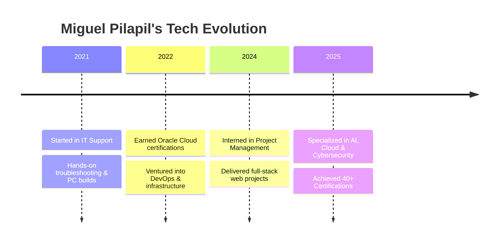

  

---

## 👨‍💻 About Me

<table align="center">
<tr>
<td width="60%">

I’m Miguel Pilapil, a multi-certified tech polymath deeply passionate about solving real-world challenges through innovation. Currently pursuing my BS in Information Technology at New Era University — proudly part of the Dean’s and President’s List — I combine academic excellence with industry-grade experience across:

<ul>
  <li>🔐 Cybersecurity</li>
  <li>☁️ Cloud Computing</li>
  <li>🤖 Artificial Intelligence</li>
  <li>💻 Full-Stack Development</li>
  <li>📊 Data Science & Analytics</li>
</ul>

I thrive at the intersection of curiosity and creation — always learning, always building.

</td>
<td align="center">
  
</td>
</tr>
</table>

---

## 🌟 Featured Projects

<table align="center">
  <tr>
    <td align="center" width="33%">
      <h3>Ravi Modular Website</h3>
      
      
A complete modular business web solution with full front-end, back-end, and database systems.

      
    </td>
    <td align="center" width="33%">
      <h3>NoteZi</h3>
      
      
Kotlin-powered mobile note app featuring Firebase cloud integration and user-authentication.

      
    </td>
    <td align="center" width="33%">
      <h3>Yummy App</h3>
      
      
End-to-end food delivery application with robust UI/UX and real-time order tracking.

      
    </td>
  </tr>
  <tr>
    <td align="center" width="33%">
      <h3>Online Banking System</h3>
      
      
Secure online banking interface with full-stack development and SQL database integration.

      
    </td>
    <td align="center" colspan="2">
      <h3>🔭 Currently Working On</h3>
      <ul align="left">
        <li>🧠 Advanced AI security solutions for threat detection</li>
        <li>☁️ Cloud-native microservice architecture</li>
        <li>📈 Data visualization dashboards with interactive graphs</li>
      </ul>
    </td>
  </tr>
</table>

---

## 🛣️ My Tech Journey

---

## 💼 Experience

<b>🚀 IT Project Intern @ Highly Succed Inc. (2024–2025)</b>

<ul>
  <li>Planned and tracked project deliverables, timelines, and risks</li>
  <li>Worked cross-functionally with IT teams for project execution</li>
  <li>Maintained documentation and reports for stakeholders</li>
  <li>Utilized PM tools like Gantt charts and Agile methodologies</li>
</ul>

<b>🖥️ Tech Staff (2021–2022)</b>

<ul>
  <li>Diagnosed and repaired hardware/software issues</li>
  <li>Built and optimized custom PCs</li>
  <li>Supported desktop systems and local network setups</li>
</ul>

---

## 🛠️ Tech Stack

  
  
  
  
  
  
  
  
  
  
  
  
  
  
  

---

## 🏅 Certifications

<b>🎓 View 40+ Professional Certifications</b>

### 🤖 Artificial Intelligence & Machine Learning
- Deep Learning with TensorFlow – IBM & Cognitive Class  
- Microsoft GenAI Series (5 Certifications)  
- AI for Career Growth – JobStreet  

### ☁️ Cloud Computing
- Oracle Cloud Certified Associate  
- AWS Security & AMS  
- IBM Cloud Essentials  

### 🔒 Cybersecurity
- Cisco Ethical Hacker  
- Cybersecurity for SMBs – AWS  
- Cisco Introduction to Cybersecurity  

### 📊 Data Science & Analytics
- Data Science Foundations – IBM  
- Data Analysis with Python – FreeCodeCamp  
- SQL and Relational Databases – IBM  

### 💻 Software Development
- Python for Data Science – IBM  
- Scientific Computing with Python – FreeCodeCamp  
- JavaScript Algorithms and DSA – FreeCodeCamp  

### 🌐 Web Development
- Responsive Web Design – FreeCodeCamp  
- ReactJS for Beginners – Simplilearn  
- Front-End Developer Certification – FreeCodeCamp  

...and many more!

---

> ⚡ *"Technology is not just a tool — it's my language of innovation."*  
> – Miguel Pilapil
