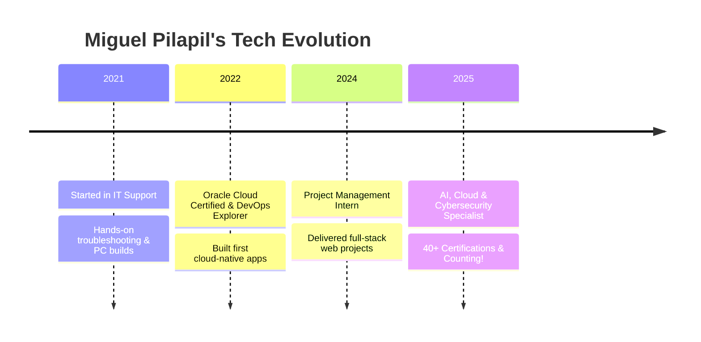

  

---

  
  
  
  
  

---

## 🔥 Welcome to My Digital Universe!

Hey there! I’m **Miguel Pilapil** — a tech polymath, relentless innovator, and passionate builder. With 40+ certifications and a drive for excellence, I thrive at the intersection of curiosity, creativity, and cutting-edge technology. Whether it’s defending cyberspace, building scalable cloud solutions, or crafting intelligent AI, I’m always pushing boundaries and delivering results.

---

## 🚀 Quick Links

- [TryHackMe Profile](https://tryhackme.com/p/MIGKOUEL) 
- [HackerRank Profile](https://www.hackerrank.com/profile/miguel_pilapil) 

---

## 👨‍💻 About Me

<table align="center">
<tr>
<td width="60%">

🎓 <b>BS Information Technology @ New Era University</b>  
Dean’s & President’s List | 40+ Professional Certifications

<ul>
  <li>🔐 Cybersecurity Specialist</li>
  <li>☁️ Cloud Computing Architect</li>
  <li>🤖 AI & Machine Learning Enthusiast</li>
  <li>💻 Full-Stack Developer</li>
  <li>📊 Data Science & Analytics Pro</li>
</ul>

I’m a lifelong learner and problem solver, always seeking new challenges and opportunities to innovate. My journey is fueled by a passion for technology and a commitment to making a real-world impact.

</td>
<td align="center">
  
</td>
</tr>
</table>

---

## 🌟 Featured Portfolio Projects

<table align="center">
  <tr>
    <td align="center" width="33%">
      <h3>Ravi Modular Website</h3>
      
      
Enterprise-grade modular business platform with seamless front-end, back-end, and database integration.

      
       <a href="#">🔗 View Project</a>
    </td>
    <td align="center" width="33%">
      <h3>NoteZi</h3>
      
      
Kotlin-powered note-taking app with Firebase cloud sync and secure user authentication.

      
       <a href="#">🔗 View Project</a>
    </td>
    <td align="center" width="33%">
      <h3>Yummy App</h3>
      
      
End-to-end food delivery platform with real-time order tracking and a delightful user experience.

      
       <a href="#">🔗 View Project</a>
    </td>
  </tr>
  <tr>
    <td align="center" width="33%">
      <h3>Online Banking System</h3>
      
      
Secure, full-stack online banking solution with robust SQL database integration.

      
       <a href="#">🔗 View Project</a>
    </td>
    <td align="center" colspan="2">
      <h3>🔭 Currently Building</h3>
      <ul align="left">
        <li>🧠 Advanced AI security solutions for next-gen threat detection</li>
        <li>☁️ Cloud-native microservice architectures</li>
        <li>📈 Interactive data visualization dashboards</li>
        <li>🌐 Open-source contributions and community projects</li>
      </ul>
    </td>
  </tr>
</table>

---

## 🛣️ My Tech Journey

---

## 💼 Professional Experience

<b>🚀 IT Project Intern @ Highly Succed Inc. (2024–2025)</b>

<ul>
  <li>Orchestrated project deliverables, timelines, and risk management</li>
  <li>Collaborated with cross-functional IT teams for seamless execution</li>
  <li>Maintained comprehensive documentation and stakeholder reports</li>
  <li>Leveraged Agile and Gantt methodologies for project success</li>
</ul>

<b>🖥️ Tech Staff (2021–2022)</b>

<ul>
  <li>Diagnosed and resolved complex hardware/software issues</li>
  <li>Built and optimized high-performance custom PCs</li>
  <li>Supported desktop systems and local network infrastructures</li>
</ul>

---

## 🛠️ My Tech Toolbox

  
  
  
  
  
  
  
  
  
  
  
  
  
  
  

---

## 🏅 Certifications & Achievements

<b>🎓 Explore 40+ Professional Certifications</b>

### 🤖 Artificial Intelligence & Machine Learning
- Deep Learning with TensorFlow – IBM & Cognitive Class  
- Microsoft GenAI Series (5 Certifications)  
- AI for Career Growth – JobStreet  

### ☁️ Cloud Computing
- Oracle Cloud Certified Associate  
- AWS Security & AMS  
- IBM Cloud Essentials  

### 🔒 Cybersecurity
- Cisco Ethical Hacker  
- Cybersecurity for SMBs – AWS  
- Cisco Introduction to Cybersecurity  

### 📊 Data Science & Analytics
- Data Science Foundations – IBM  
- Data Analysis with Python – FreeCodeCamp  
- SQL and Relational Databases – IBM  

### 💻 Software Development
- Python for Data Science – IBM  
- Scientific Computing with Python – FreeCodeCamp  
- JavaScript Algorithms and DSA – FreeCodeCamp  

### 🌐 Web Development
- Responsive Web Design – FreeCodeCamp  
- ReactJS for Beginners – Simplilearn  
- Front-End Developer Certification – FreeCodeCamp  

...and many more!

---

> ⚡ *"Technology isn’t just my career — it’s my playground, my passion, and my way to change the world."*  
> – Miguel Pilapil
